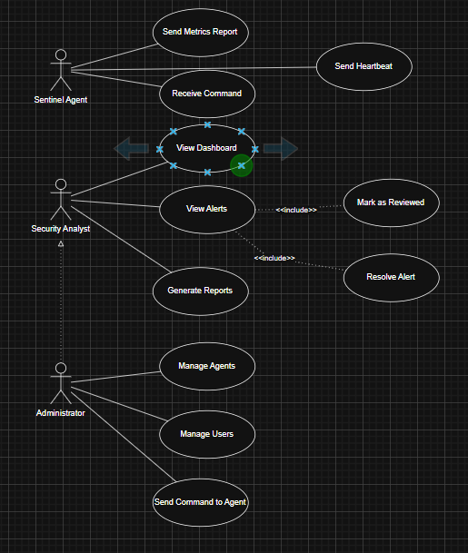
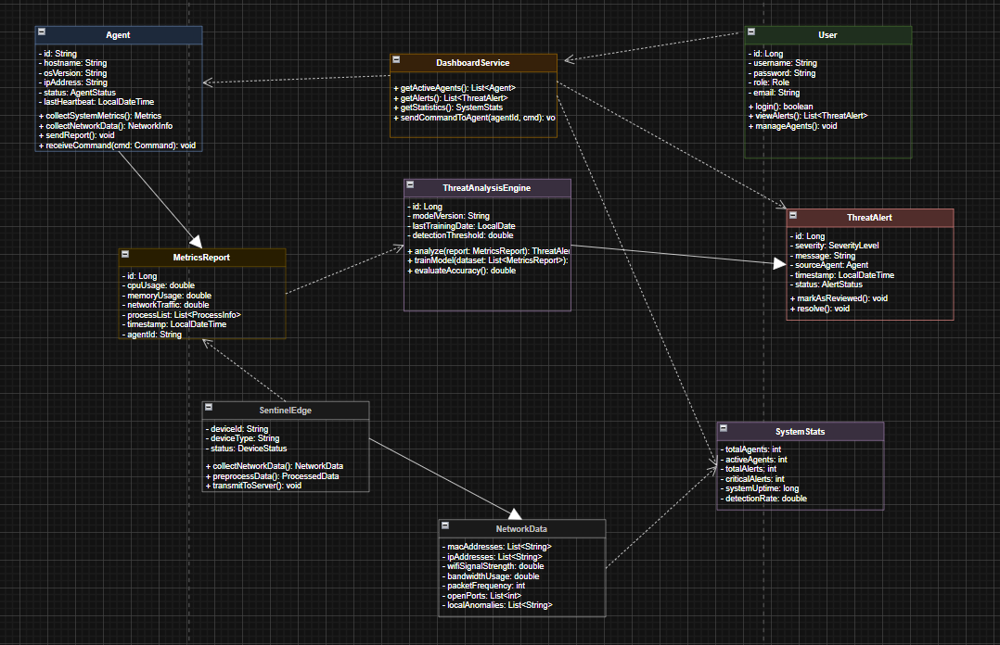

# SentinelAgent

An early-stage SOC-oriented cybersecurity platform that correlates telemetry (network / host signals) with AI-assisted analysis to surface suspicious activity and generate actionable security reports.

> Status: Active development (not production-ready yet).

## Why SentinelAgent?
Modern security teams need fast visibility, triage assistance, and clear reporting. SentinelAgent focuses on:
- Collecting/ingesting security signals (telemetry)
- Normalizing & correlating events
- Applying AI-assisted triage (classification, enrichment, summaries)
- Producing dashboards and investigation-ready reports

## Architecture (high level)
**Components**
- **backend/**: Core API, event ingestion, correlation logic, storage access, auth (if applicable)
- **frontend/**: SOC dashboard (alerts, metrics, reports)
- **AI/**: notebooks / ML experiments / models for detection & enrichment
- **iris_service/**: auxiliary service (e.g., enrichment, integrations, routing) — describe purpose

**Data flow**
1) Telemetry → backend ingestion
2) Backend → normalization/correlation → storage
3) AI service → enrichment / scoring (optional sync/async)
4) Frontend → consumes backend APIs → dashboards/reports

> See diagrams in the repository (Use Case / Class Diagram / etc.)


### use case diagrame




### mmrd


### classe diagrame




## Tech Stack
- Frontend: TypeScript (UI dashboard)
- Backend: Java (API/services)
- AI: Python (ML notebooks/models)
- Additional tooling: Go (utilities / agent experiments)

## Features
- Real-time / near real-time alerting (MVP scope)
- AI-assisted analysis (triage, enrichment)
- Metrics & reporting dashboards

## Quick Start (local)
### 1) Clone
```bash
git clone https://github.com/ABDERRAZZAK-IMILY/SentinelAgent.git
cd SentinelAgent

